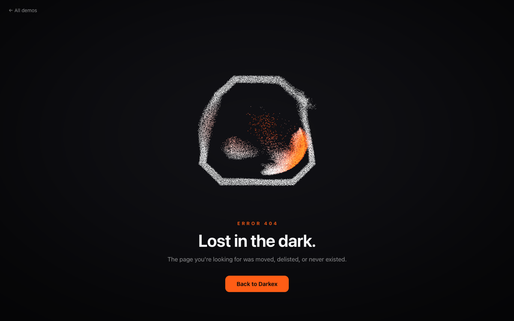
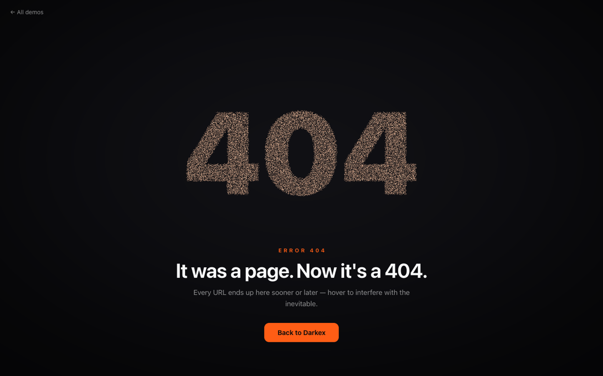
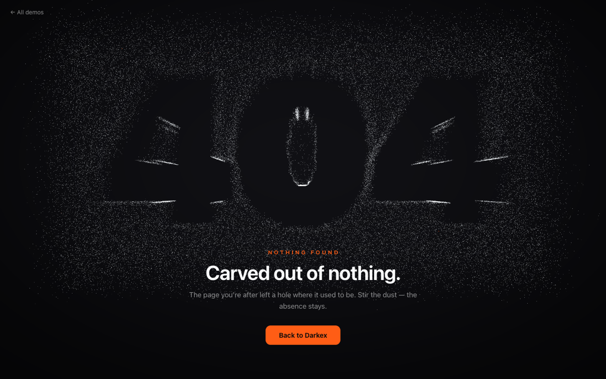
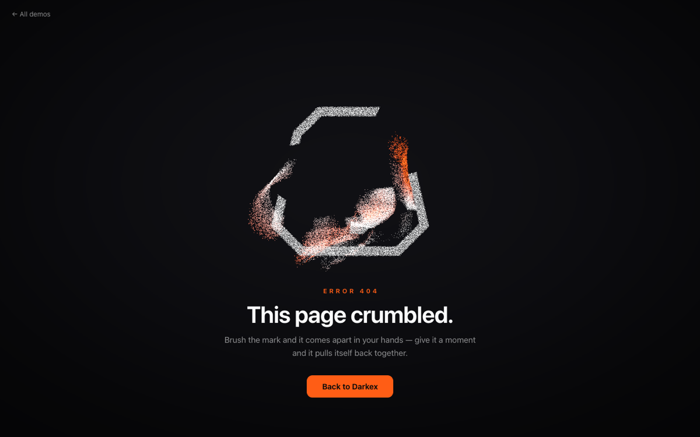
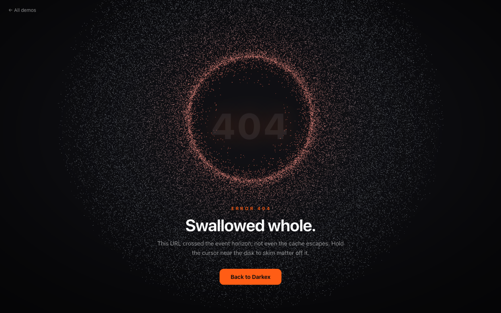

# The 404 Lab — Darkex particle studies

**Live: <https://okturan.github.io/darkex-404-lab/>**

Five takes on a 404 page for [darkex.com](https://www.darkex.com/en), each one
a GPU particle system built from the Darkex mark and the error itself.

## Five live studies

Each thumbnail is a frame captured from its corresponding demo in this
repository. The static images prove the authored visual states; follow the
live links to verify motion, cursor response, and recovery behavior.

| [Assembly](https://okturan.github.io/darkex-404-lab/demos/ember/) | [Inevitable](https://okturan.github.io/darkex-404-lab/demos/morph/) | [Negative Space](https://okturan.github.io/darkex-404-lab/demos/hollow/) | [Crumble](https://okturan.github.io/darkex-404-lab/demos/sandfall/) | [Event Horizon](https://okturan.github.io/darkex-404-lab/demos/horizon/) |
| :---: | :---: | :---: | :---: | :---: |
| [](https://okturan.github.io/darkex-404-lab/demos/ember/) | [](https://okturan.github.io/darkex-404-lab/demos/morph/) | [](https://okturan.github.io/darkex-404-lab/demos/hollow/) | [](https://okturan.github.io/darkex-404-lab/demos/sandfall/) | [](https://okturan.github.io/darkex-404-lab/demos/horizon/) |

All five run the same architecture: grain state in storage buffers, one TSL
compute pass per frame, an additive sprite population, and a pointer
projected onto the grains' plane. three.js r185, `three/webgpu` +
`three/tsl`; WebGPU where available, transparent WebGL2 fallback otherwise.

| Demo | Taste | The idea |
| --- | --- | --- |
| [Assembly](https://okturan.github.io/darkex-404-lab/demos/ember/) | elegant | The mark assembles from drifting dust; the cursor scatters embers through the line-work. |
| [Inevitable](https://okturan.github.io/darkex-404-lab/demos/morph/) | kinetic type | One grain population, two home sets — the mark and "404" trade places forever; interfere mid-flight. |
| [Negative Space](https://okturan.github.io/darkex-404-lab/demos/hollow/) | atmospheric | A slab of fog with "404" carved out of it; an ink-mask gradient force keeps the absence carved. |
| [Crumble](https://okturan.github.io/darkex-404-lab/demos/sandfall/) | physics toy | Touch melts the mark into falling sand — piles up, then the spring hauls every grain home. |
| [Event Horizon](https://okturan.github.io/darkex-404-lab/demos/horizon/) | cosmic | An accretion disk feeds the hole where the page used to be; the cursor is a second gravity well. |

## Release (the production artifact)

Assembly is the production pick. `bun run release` regenerates the two
archives published in [v1.4.0](https://github.com/okturan/darkex-404-lab/releases/tag/v1.4.0):

- `darkex-404-v1.4.0.zip` — the full page as a self-contained `404.html`,
  plus the handoff README and reference `logo.svg`.
- `darkex-mark-v1.4.0.zip` — the interactive mark without page copy or CTA,
  plus its own README and reference `logo.svg`.

Neither artifact needs build tools or Bun to use or edit. Copy lives in
HTML, colors live in CSS variables the engine reads at boot, the logo lives
in a `<template>` (swap the SVG, favicon follows), and the feel lives in one
commented `window.DARKEX404` block. The full-page template is
`release/404.template.html`; the engine source is `release/engine.js`.

## Run

```sh
bun install
bun run dev            # gallery + all demos with HMR → http://localhost:3000
bun run build          # static site → docs/ (what GitHub Pages serves)
bun run build:single   # the Assembly demo as one self-contained file → dist/404.html
bun run release        # designer-facing release zip → release/darkex-404-v*.zip
```

Opening source HTML from `file://` shows nothing by design — the pages import
bare specifiers and are meant for the dev server or a build. `dist/404.html`
is the double-clickable artifact.

## Architecture

```
index.html + gallery.css     the demo index (static, no three.js)
lib/
  points.js                  artwork → grains: SVG/text rasterizers, scatter, pad
  logo.js                    the mark inlined as a data URI (see file for why)
  pointer.js                 cursor → z=0-plane uniforms (eased position + velocity)
  stage.js                   renderer, viewport-fitting camera, vignette backdrop
  grains.js                  shared sprite-material nodes (soft disc, heat ramp, sizes)
  page.css                   shared demo chrome
demos/<name>/
  config.js                  every tunable, with units — start here to retune
  particles.js               the demo's storage buffers + TSL compute pass + material
  main.js                    composition root and the three-call frame loop
  index.html                 copy + CTA
```

Each demo's compute pass integrates `acceleration = spring + wander + pointer`
(semi-implicit Euler, exponential drag), then varies the recipe: morph blends
two home buffers under an eased uniform; hollow differentiates a blurred
"404" ink texture into an eviction force; sandfall adds a per-grain
`looseness` scalar that trades the spring for gravity and a floor; horizon
replaces homes entirely with central gravity, orbital seeding, and
consume-and-respawn at the horizon. Speed feeds back into every material as
an ember tint (`#FF5D15`, from darkex.com's design tokens).

## Deploying one as a real 404

Any single demo works standalone: serve its built directory (or
`dist/404.html`) with a 404 status — nginx `error_page 404`, Cloudflare
Pages / Netlify `404.html`, or an S3 error document.

## GitHub Pages

The site deploys from `main:/docs` (Settings → Pages). `bun run build`
regenerates `docs/`; commit and push to redeploy. Thumbnails under
`assets/thumbs/` are captured from the demos themselves.
